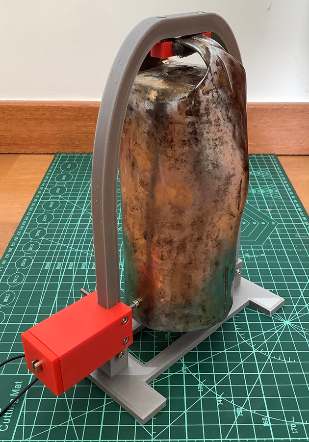
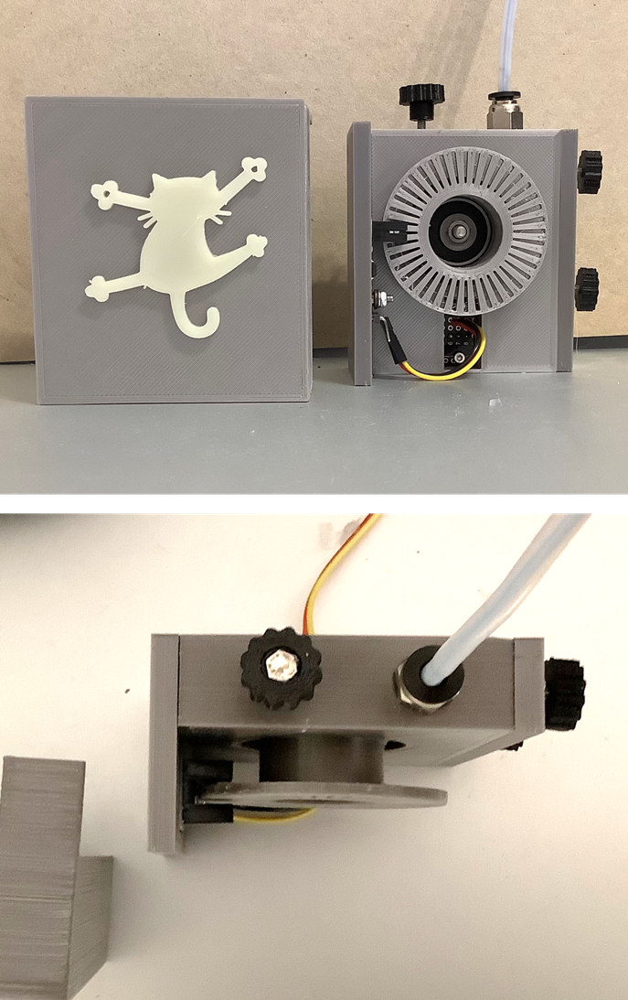
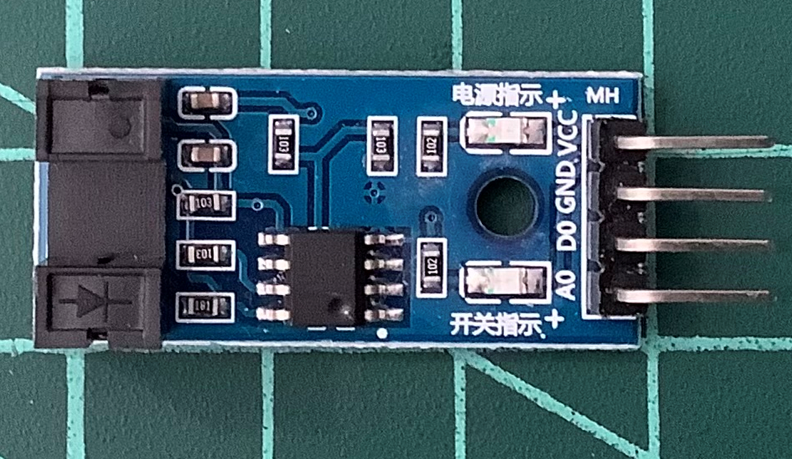

# OctoPrint Bovine Filament Sensor

[OctoPrint](http://octoprint.org/) plug-in that lets integrate a Filament Sensor into your filament path.

The plug-in monitors the sensor signal and produces several responses in case it doesn't sense filament movement.
Responses include Pausing the print and Remote activation of a real cow-bell-based alarm in the same Wi-Fi network.



This is a fork of [Octoprint-Smart-Filament-Sensor](https://github.com/Royrdan/Octoprint-Smart-Filament-Sensor) by Royrdan.  
The following is mostly a reproduction of Royrdan README, but changes are being added as long as development continues.

Initial work based on the [Octoprint-Filament-Reloaded](https://github.com/kontakt/Octoprint-Filament-Reloaded) plug-in by kontakt.
Fork of [Octoprint-Filament-Revolutions](https://github.com/RomRider/Octoprint-Filament-Revolutions) plug-in by RomRider.

The solution for this plugin is inspired by [Marlin Firmware](https://github.com/MarlinFirmware/Marlin)

## Required sensor

To use this plug-in a Filament Sensor like the one described by [Makers Mashups](https://youtu.be/v2mQ4X1J3cs) is needed.

The version I built:



It is based on a cheap IR Optocoupler with an LM393 comparator easily found in Amazon.



The filament passing through the device makes the wheel turn.  
The octocoupler originates a toogling digital signal (0-1-0...) as the wheel windows impede of let pass the IR light.  
This signal is sent to the RPi through a GPIO pin which is monitored by the plug-in.


## Features

* Configurable GPIO pins.
* Support commercial and homemade digital filament detection sensors.
* Detect if filament is not moving anymore (even jammed or runout)
    * Detection based on timeout.
    * Detection based on extruder filament lenght.
* Several alternative print pausing commands.
* Raise Wi-Fi signal to trigger remote devices (i.e an automatic Cow-Bell)

## Installation

The OctoPrint Bovine Filament Sensor plugin is not yet fully functional.

## Configuration
### GPIO Pin
* There are two different ways to number the GPIO pins:  
  - BCM (Broadcom) - Correspond to the SOC channel number and represented as GPIOn (i.e GPIO23)
  - Board (Physical) - the position of the pin on the board.  

  Thus, for example, Board Pin **11** <=> GPIO**17**.  
  Select the numbering mode in the plug-in settings.
* Choose any free GPIO data pin, using preferently one with no special functionality like e.g. I2C.  
  I use GPIO24 which is next to a ground pin and in front of a 3V3 pin.  
  Please check the [documentation](https://www.raspberrypi.org/documentation/usage/gpio/) of your Raspberry Pi version/model. 
* Run the sensor only on 3.3V, because Raspberry GPIO pins don't like 5V.
* In [BigTreeTech SmartFilamentSensor Manual](https://github.com/bigtreetech/smart-filament-detection-module/tree/master/manual) on page 12 you can find the functionality of the pins.


BTT Pins are labeled as follows:

S for SIN  ---> signal line, to chosen signal GPIO input pin.  
G for GND  ---> To Ground pin.   
V for VDD  ---> To +3.3v pin.

The ZHITING LM393 I use, is labelled as follows (see picture above):

A0 ---> Not used. Analogic output.  
D0 ---> Digital signal. To chosen signal GPIO input pin.  
GND ---> To Ground pin.  
VCC ---> To +3.3v pin.

### Detection time
Currently, it is necessary to configure a maximum time period no filament movement was detected.   
This time could be depended on the print speed and maximum print line length, so you should determine empirically its value.
The default value (45 s) was estimated on max. print speed 10 mm/s, for faster prints it could be smaller.

### Detection distance
Alternatively, this plugin can also respond based on the expected length of filament consumed.  
Therefore it is necessary to configure a distance without movement being detected. 
These distance is calculated from the G-code sent to the printer.  
In Marlin Firmware the default value is set to 7 mm. I recommend to set it higher than in the firmware, because it could make the detection too sensitive.

### Octoprint - Firmware & Protocol
Several commands are available in the "Pausing commands" setting to interrupt the print.  
Available commands include [M0, M1, M25, M226, M600, M601]. Select the most appropriate for your printer.  

### Octoprint - GCode Scripts
If you do not want that the print is paused right on your print, I recommend to add a GCode Script for "After print job is paused".  
Also adding GCode script "Before print job is resumed" might be useful, in the case you hit the heatbed or print head during the change of the filament or removing the blockage.

### connection_check test script
This script is provided to test the communication between the plugin and the filament sensor.
Run this script on the raspberry shell using:  

    $ python3 connection_check.py  
For the test you can pass and move manually a short lengh of filament through the filament detector.   
DO NOT run this script during a print.

## G-code
### Start G-code
The sensor is activated after a number of Z-position changes (through G0-G3 G-code commands) take place in the printer.  
The number of Z movements for activation depends on your Start G-code and can be set on settings.  
For a Snapmaker with the Start G-code shown below, this value has to be set to 1.

E.g.
```
M104 S{material_print_temperature_layer_0} ;Set Hotend Temperature
M140 S{material_bed_temperature_layer_0} ;Set Bed Temperature
G28 ;home
G90 ;absolute positioning
G1 X-10 Y-10 F3000 ;Move to corner 
G1 Z0 F1800 ;Go to zero offset
M109 S{material_print_temperature_layer_0} ;Wait for Hotend Temperature
M190 S{material_bed_temperature_layer_0} ;Wait for Bed Temperature
G92 E0 ;Zero set extruder position
G1 E20 F200 ;Feed filament to clear nozzle
G92 E0 ;Zero set extruder position
```

## Disclaimer
* I as author of this plugin am not responsible for any damages on your print or printer. As user you are responsible for a sensible usage of this plugin.
* Be cautious not to damage your Raspberry Pi, because of wrong voltage. I don't take any responsibility for wrong wiring.

